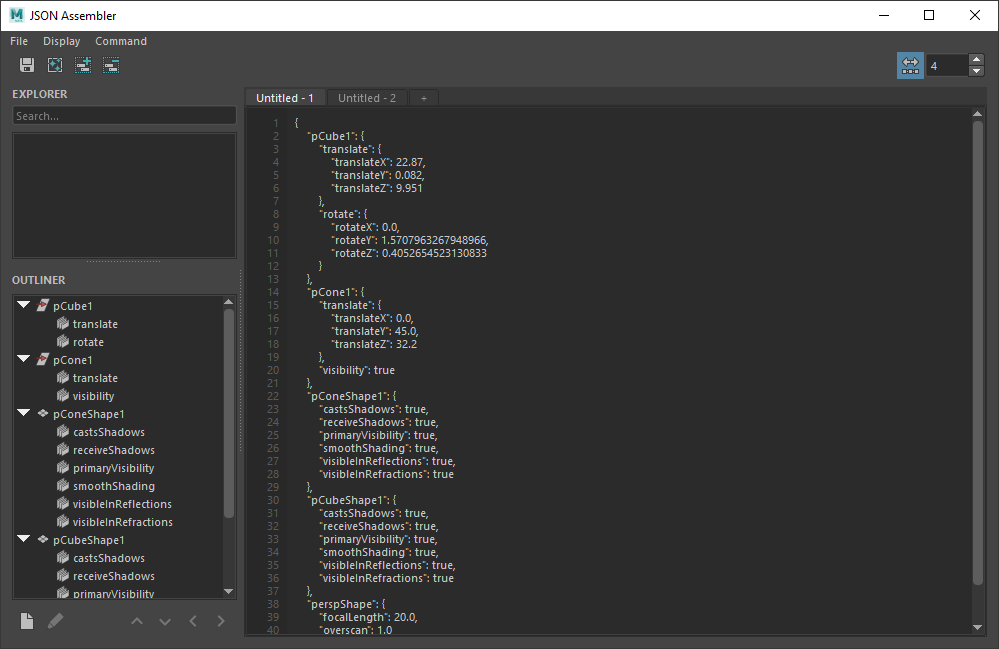

# json_assembler

While the automated processes of a studio's pipeline may be sound, there are times where some manual input may be required. In the case of tasks such as constructing a JSON file, few artist friendly methods are available to accomplish this. In comes the JSON Assembler! Insert values from objects in your scene and arrange them as you please. A live preview of the final output is displayed and updated as changes are made to the file.

<div align=center>

</div>

## Features

- Construct JSON files using the contents of your Maya scene. The contents of your active selection can be searched through to find and add nodes, attributes, and their respective values.

   - Use display filters and the search bar to locate useful data much more rapidly.

- Manually input any string, number, object, array, boolean, or null data.

- Arrange the contents as you please. Items can be reordered and organized hierarchically.

    - Data can be nested any number of levels deep.

- Control the formatting. Save or preview the file with indentation or flatten it to conserve file space.

- Open tabs to work on multiple files simultaneously.

## Installation

 1. Clone the repository: `git clone https://github.com/ldlafontaine/json_assembler.git`

 2. Copy the contents of the `src` folder into any location on the Maya script path, such as your `prefs/scripts` folder.

 5. Open Maya and run the following Python script from your script editor:
```
import json_assembler
json_assembler.run()
```